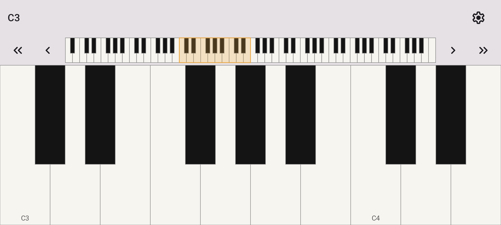
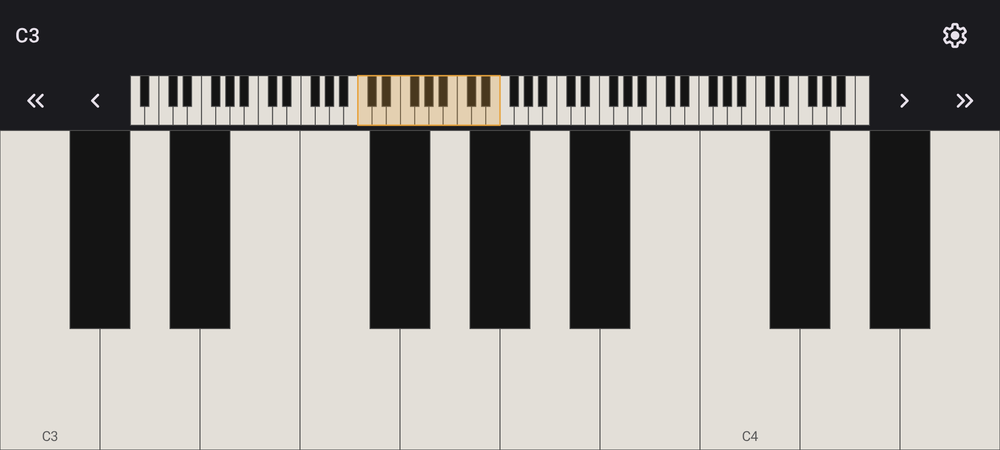
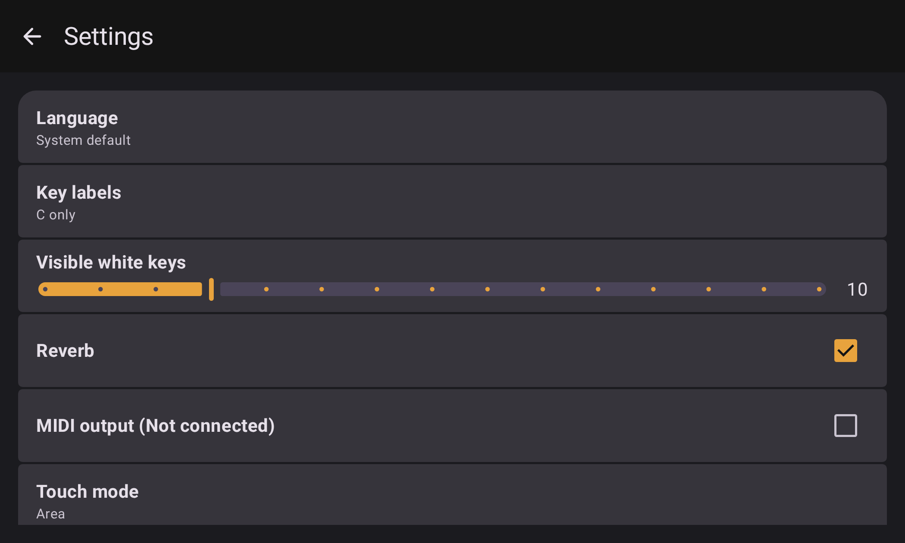

<a href="https://buymeacoffee.com/thomas.kiljanczyk.dev"></a>

[](https://github.com/ThomasKiljanczykDev/OpenPiano/actions/workflows/ci-android.yml)
[](https://github.com/ThomasKiljanczykDev/OpenPiano/actions/workflows/cd-privacy-policy.yml)
[](../LICENSE)

# OpenPiano Android Client

Android app module for OpenPiano — see the [root README](../README.md) for what it is.

No ads, no in-app purchases, no account.

## Features

### Keyboard

Touch the keys to play. The overview strip above the keys doubles as a scrollbar,
so you can jump anywhere across the full 88-key range.

<p float="left">
  
  
</p>

### Settings

Key labels, visible key count, reverb, MIDI output, and touch hit-testing mode (point vs. area,
with a configurable overlap threshold) are all user-adjustable.



## Build

The Gradle build lives in `android/`.

```
cd android
./gradlew assembleDebug
./gradlew installDebug          # run on a connected device
```

Requires JDK 17 and the Android SDK with the NDK installed (native code is built as part of `assemble`).
See [AGENTS.md](../AGENTS.md#verification) for the full verification commands (detekt, lint, tests).

## Module structure

See [AGENTS.md](../AGENTS.md#modules) for the module map and dependency rules.
