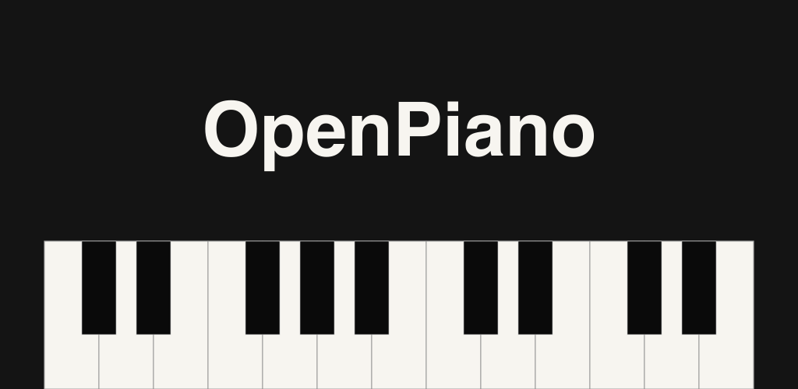
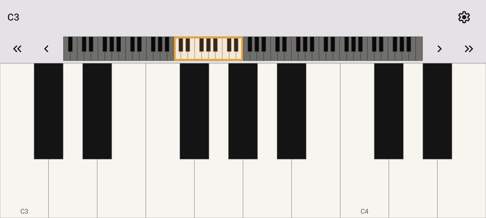
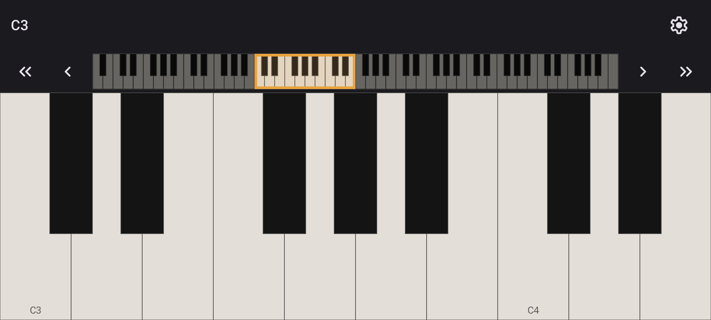
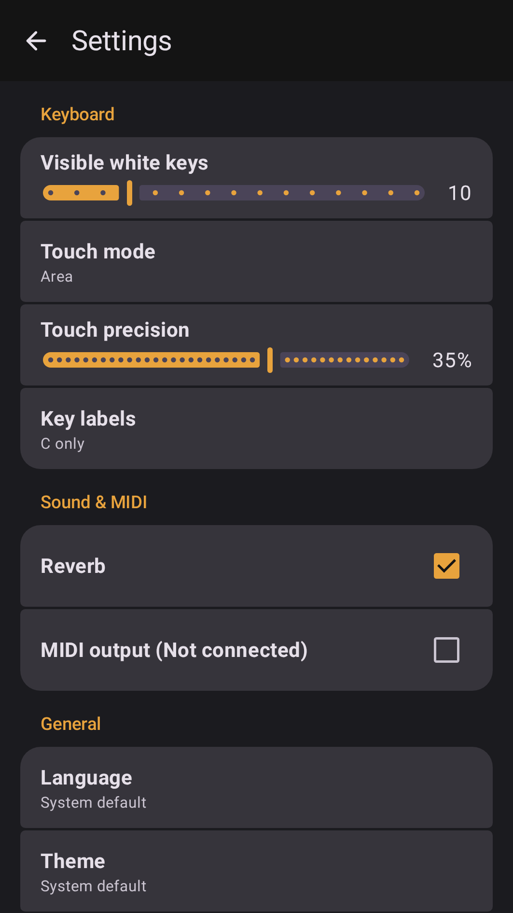

<p>
  
  
  <a href="https://buymeacoffee.com/thomas.kiljanczyk.dev"></a>
</p>

[](https://github.com/ThomasKiljanczykDev/OpenPiano/actions/workflows/ci-android.yml)
[](https://github.com/ThomasKiljanczykDev/OpenPiano/actions/workflows/cd-privacy-policy.yml)
[](../LICENSE)

# OpenPiano Android Client

Android app module for OpenPiano — see the [root README](../README.md) for what it is.

No ads, no in-app purchases, no account.

## Features

### Keyboard

Touch the keys to play. Multitouch plays chords; sliding across keys plays a glissando.
The overview strip above the keys highlights the visible window and doubles as a scrollbar,
so you can jump anywhere across the full 88-key range.
The arrow buttons shift the window by one key or one octave.

<p float="left">
  
  
</p>

### Settings

Grouped into three sections:

- **Keyboard**: visible key count, touch mode (point vs. area, with a configurable overlap threshold), key labels.
- **Sound & MIDI**: reverb, USB MIDI output.
- **General**: language, theme (system, light, dark), guided tour replay.

The keyboard is landscape-only; the settings screen also rotates to portrait.



### Guided tour

On first launch, a short spotlight tour walks through the keyboard controls and the key settings.
Replay it any time from **Settings › Show tutorial again**.

## Build

The Gradle build lives in `android/`.

```
cd android
./gradlew assembleFossDebug
./gradlew installFossDebug      # run on a connected device
```

Requires JDK 17 and the Android SDK with the NDK installed (native code is built as part of `assemble`).
The `play` flavor needs your own `app/src/play/google-services.json`;
see [AGENTS.md](../AGENTS.md#product-flavors).
See [AGENTS.md](../AGENTS.md#verification) for the full verification commands (detekt, lint, tests).

## Module structure

See [AGENTS.md](../AGENTS.md#modules) for the module map and dependency rules.
